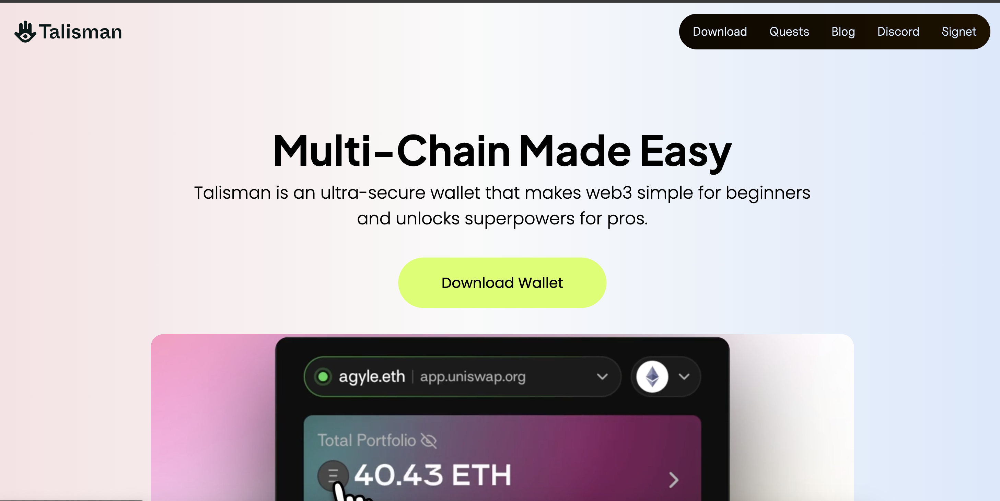
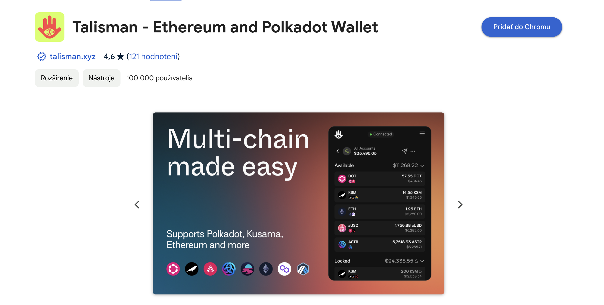
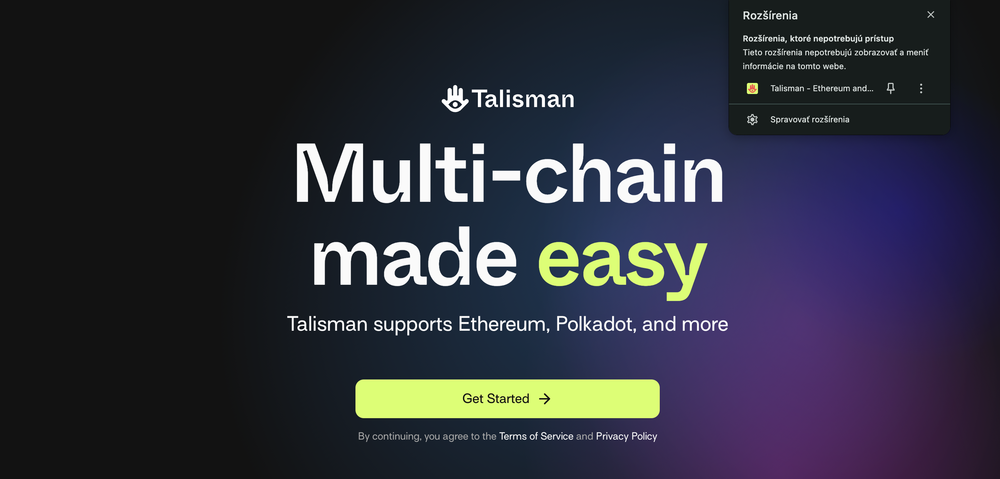
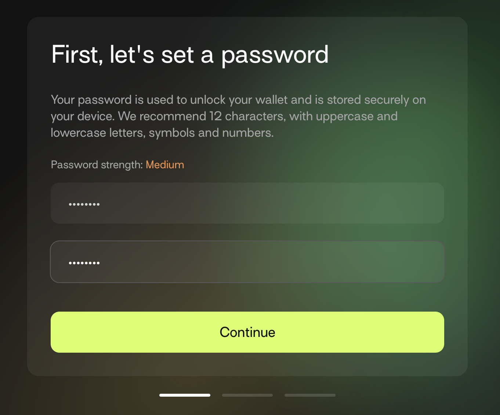
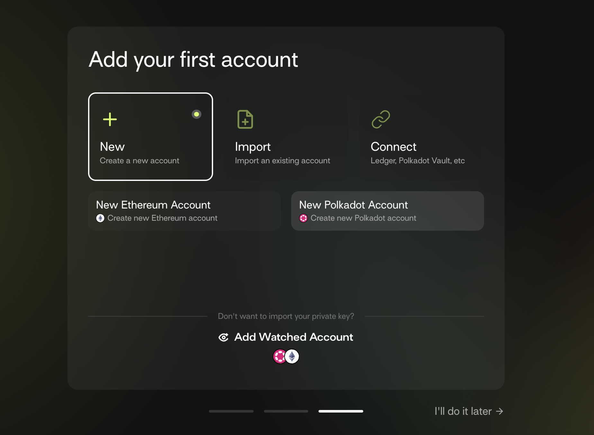
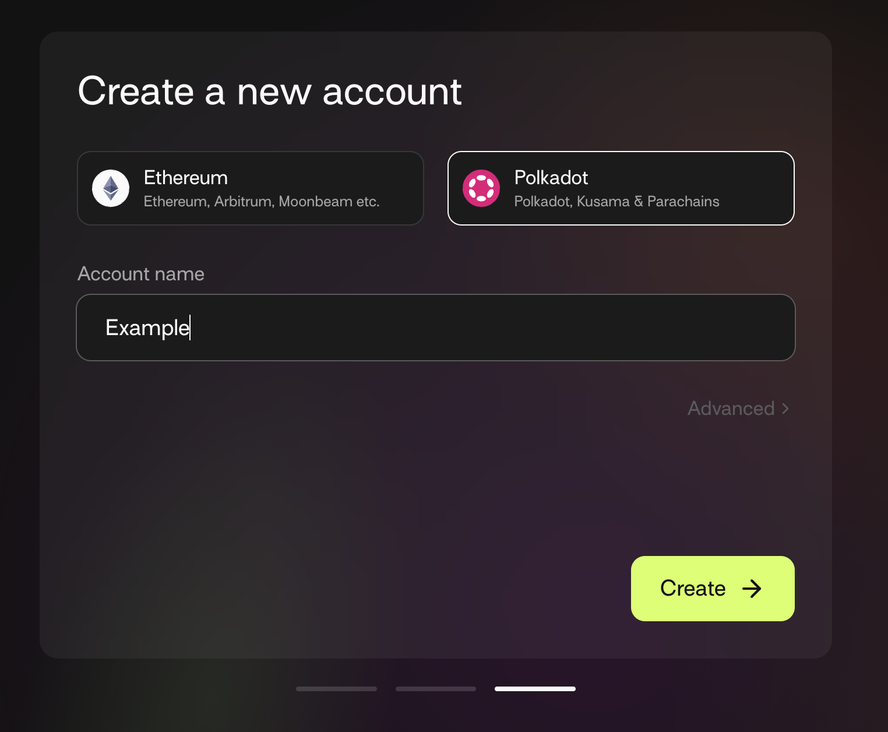
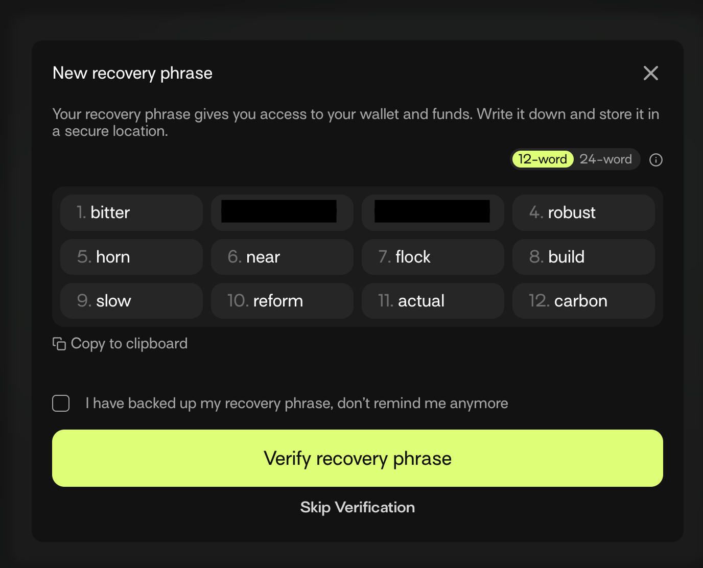
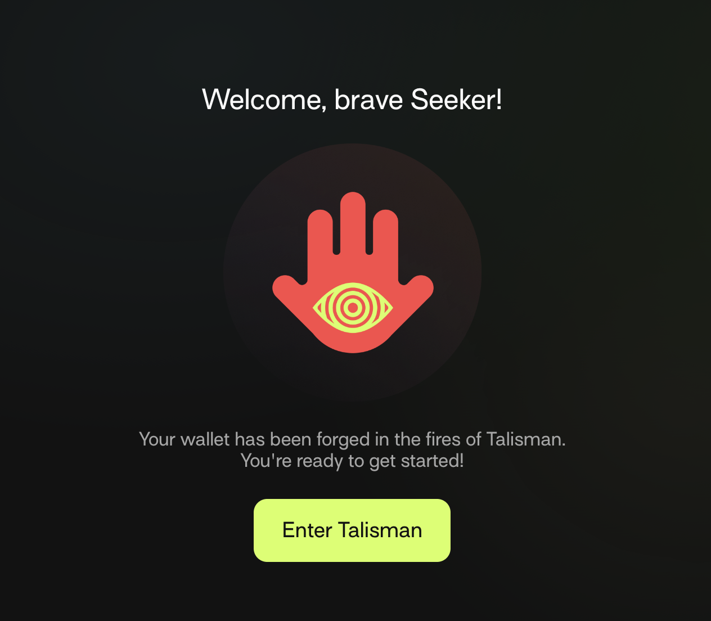
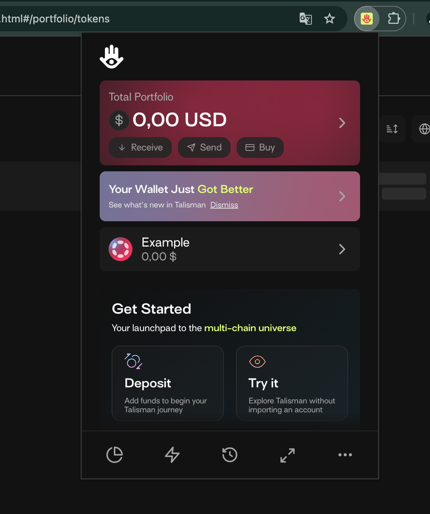

# Guide to Create a Wallet for Interaction with Your First NFT Assets 🖼️

  

A wallet is a tool that allows you to interact with Blockchain and sign transactions.

  

In the case of EVA Gallery, interaction with your wallet will be used to create new NFT assets and receive assets if you decide to try a free mint example.

  

There are multiple wallet providers for different blockchains. The blockchain that EVA Gallery is integrated with is Kusama. Kusama is a multichain network with great cross-chain capabilities, fast transaction processing times, and very cheap transaction fees. Creating an NFT asset on Kusama costs less than 1 cent!

  

## What is a Blockchain Wallet? 🏦

  

A blockchain wallet is a digital wallet that allows you to store and manage your cryptocurrency, including NFTs. It enables you to send, receive, and monitor your cryptocurrency balances. Unlike a traditional wallet that holds physical money, a blockchain wallet holds cryptographic information that allows you to access your digital assets on the blockchain.

  

### Key Features of a Blockchain Wallet 🔑

  

1.  **Secure Access**: Wallets use cryptographic keys to secure your digital assets. You have a public key (like an account number) and a private key (like a password) that you must keep secret.

  

2.  **Ownership**: You control your assets without needing a third party, which is fundamental to decentralized finance.

  

3.  **Transaction Capability**: Wallets allow you to send and receive digital assets by signing transactions.

  

4.  **Compatibility**: Wallets can interact with different blockchains, supporting various cryptocurrencies and NFTs.

  

## Creating a Talisman Wallet for Kusama 🪄

  

To interact with the Kusama network and EVA Gallery, you'll need a wallet compatible with Kusama. The Talisman wallet is a user-friendly option for managing assets on Kusama and interacting with NFTs. Here’s how to set it up:

  

### Step 1: Install the Talisman Wallet 🧩

  

1.  **Visit the Talisman Website**: Go to the official Talisman website [Talisman](https://talisman.xyz/).

  

2.  **Download the Extension**: Click on the option to download the Talisman wallet extension for your browser. Talisman supports popular browsers like Chrome and Firefox.

  

3.  **Install the Extension**: Follow the prompts to add the Talisman extension to your browser. After installed you should be greeted with "Get started" page.

  

### Step 2: Create a New Wallet 🆕

  

1.  **Open the Talisman Extension**: Click on the Talisman icon in your browser's toolbar to open the wallet interface. First create new password.

2.  **Create a New Account**: Click on "Create a new account." Select Polkadot account and add name.

First you will be greeted with add account page, here select Polkadot account.

Afterwards you will be prompted to create name for your wallet.

3.  **Secure Your Seed Phrase**: Write down the seed phrase on paper and store it in a safe place. **Never share your seed phrase** with anyone, as it can be used to access your wallet and assets.

4.  **Confirm Your Seed Phrase**: You may be asked to verify your seed phrase by selecting the words in the correct order. Once you re-enter your seed phrase you will be greeted with success message.

5. **Open your wallet in browser extension location**: You can now interact with your freshly created wallet. Have fun on your blockchain journey!

### Step 3: Add Kusama Funds 💰
To interact with Blockchain you will need some funds. You can purchase Kusama (KSM) asset on any well known exchange. For example Binance or Bybit.

1.  **Receive Kusama**: Click on "Receive" to find your Kusama address. You can share this address to receive Kusama tokens.

  

2.  **Transfer Funds**: Transfer some Kusama tokens to your wallet to cover transaction fees when creating or receiving NFTs.

  

### Step 4: Interact with EVA Gallery 🎨

  

1.  **Connect Your Wallet**: Go to the EVA Gallery platform and look for an option to connect your wallet. Select Talisman from the list of supported wallets.

  

2.  **Authorize Connection**: Approve any connection requests from the platform to access your wallet.

  

3.  **Explore and Create NFTs**: Once connected, you can create new NFT assets or participate in free minting activities within the EVA Gallery.

  

## Safety Tips 🛡️

  

-  **Backup Your Seed Phrase**: Always keep a backup of your seed phrase in a secure location. Losing it means losing access to your wallet forever.

  

-  **Use Strong Passwords**: Ensure your wallet and email accounts are protected with strong, unique passwords.

  

-  **Be Cautious of Scams**: Be wary of phishing attempts. Only interact with trusted sites and never enter your seed phrase online.

  

-  **Keep Software Updated**: Regularly update your wallet and browser to protect against security vulnerabilities.

  

By following these steps, you will have successfully created a Talisman wallet and will be ready to interact with your first NFT assets on Kusama and EVA Gallery. Enjoy exploring the exciting world of NFTs! 🚀